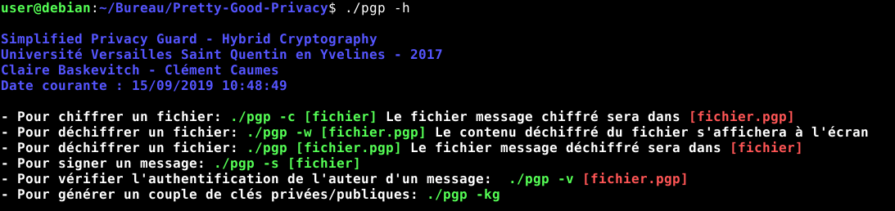
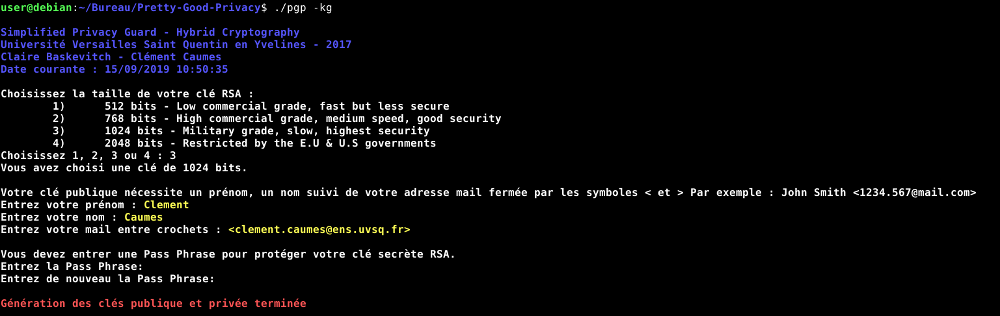
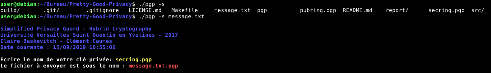
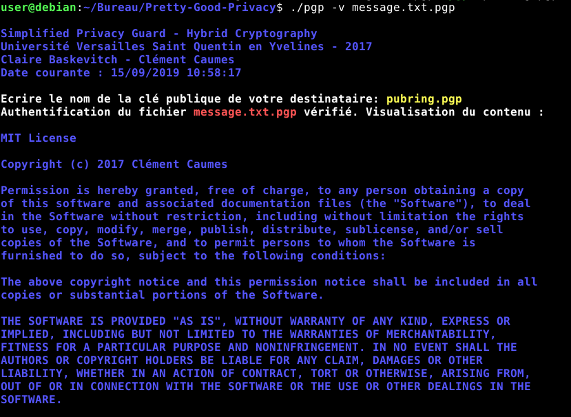
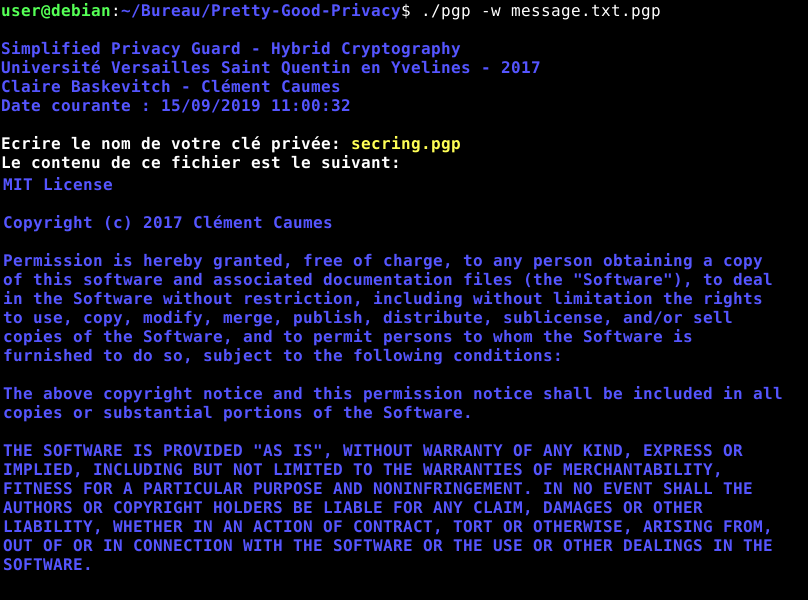

# ProtectMail

## Introduction

ProtectMail est un projet qui représente une couche supplémentaire pour la protection des 
mails. Il implémente une version simplifiée de Pretty Good Privacy avec de la cryptographie 
hybride. 
Il faut avoir préalablement installer la librairie *GMP* pour compiler ce dépôt.

## Manuel utilisateur

- Pour afficher l'aide et les commandes de l'application, l'utilisateur 
peut taper la commande suivante ```./pgp -h```



- Pour générer une paire de clés on utilise la commande ```./pgp kg```



La clé publique *pubring.pgp* et la clé privée *secring.pgp* seront générées.

- Pour signer un document sans le chiffrer : ```./pgp -s [message]```



- Pour vérifier l'authenticité d'un document : ```./pgp -v [message.pgp]```



- Pour chiffrer un document : ```./pgp -c [message]```

- - Pour déchiffrer un document : ```./pgp -w [message]``` ou ```./pgp [message]```


